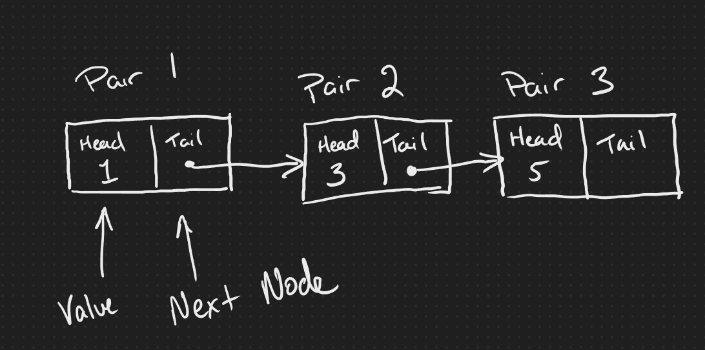
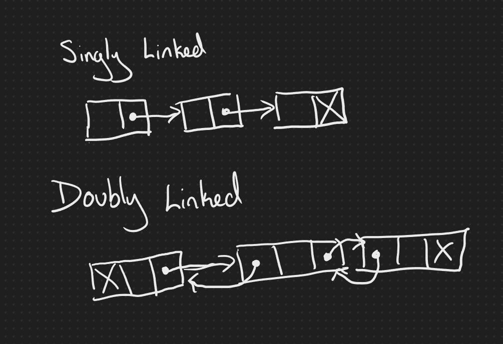

# Data Structures: Lists

We only used simple data (numbers) for the first two lessons, but there's only so much we can do with that. A single value can adequately represent very few data structures that developers work with, so we need to add a way to combine multiple data points.

## The Pair Class

One of the most straightforward compound structures we can create is what we'll call a `Pair`, which has two values: a head and a tail. For now, the data is also immutable, meaning it can't be changed after creation. Since the head or tail could contain another pair, we can use this structure to do all kinds of things.

```JavaScript
function Pair(head, tail) {
  return {head: head, tail: tail
}}
```

## Lists

Programming languages have different ways of representing groups of data, but lists are a standard option, especially when we need to loop through the items and aren't sure how many things we need to hold.

Implementing a linked list using the `Pair` class is relatively simple. Traditionally this is implemented as a `Node` class with a `value` and a `nextNode` property. Using our `head` property as the value and `tail` as the next node and it will illustrate that structure.



### Single and Doubly Linked Lists

In the dreaded whiteboard interview, there are two types of lists that are used. The one we are implementing with the `Pair` class is a singly linked list because it only holds a reference to the next node. Doubly linked lists have references to the next and previous nodes and a value.



### Working With the List

There are a few different things we can do with our pair object.

For example, we might want to find the length of the list:

```JavaScript
function length(pair) {
  if (pair === null) {
    // base case: an empty list has length 0
    return 0;
  } else {
    // recursive case: add 1 to the length of the rest of the list
    return 1 + length(pair.tail);
  }
}
```

When working with collections, there are four common tasks that we do.

push: Add an item to the end of the list
pop: Remove the last item in the list and return its value
shift: Add an item to the beginning of the list
unshift: Remove the first item in the list and return it.

While it can be useful to work though all four functions, let's just do the `push()` function.

```Javascript
function push(pair, value) {
  if (pair === null) {
    // if the list is empty, set the head to the new node
    return Pair(value,  null);
  } else if (pair.tail === null) {
    // if the current node is the last node, add the new node to the end
    const newNode = Pair(value);
    pair.tail = newNode;
    return pair;
  } else {
    // recursively call push on the next node in the list
    pair.tail = push(pair.tail, value);
    return pair;
  }
}
```

## Creating a Complex Object With a Linked List

While there are more efficient ways to store a complex object, this pair concept is enough to create the types of objects we are used to working with.

The head of each node in the linked list could hold another pair. That child pair would contain the head as a property name and the tail as the value.

We can derive some interesting methods from this concept, including finding the value by property name instead of by an index.

```JavaScript
function findPropertyValue(pair, propertyName) {

  if (pair === null) {
    // base case: the end of the list has been reached without finding the property
    return null;
  } 

const value = pair.head
if (value.head === propertyName) {
    // base case: the property has been found
    return value.tail;
  } else {
    // recursive case: check the rest of the list
    return findPropertyValue(pair.tail, propertyName);
  }
}
```

